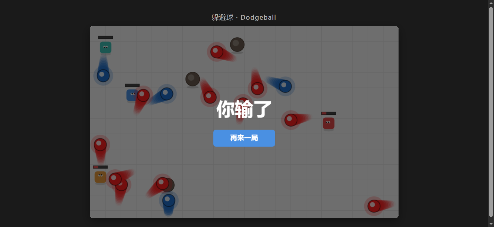
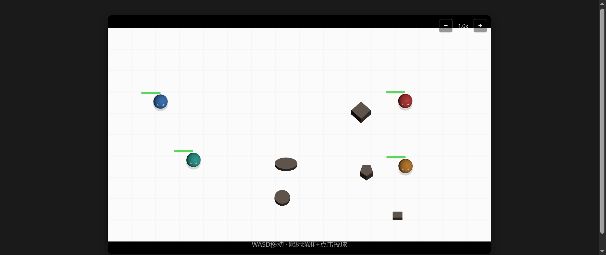

# 躲避球 Dodgeball

2v2 顶视角躲避球小游戏，零依赖、单文件运行。

三个技术栈实现，玩法完全一致：

| 入口文件 | 渲染/物理引擎 | 特点 |
|---------|--------------|------|
| **`vanilla.html`** | 原生 HTML5 Canvas + 手写物理 | 无任何外部依赖，代码紧凑易读 |
| **`phaser.html`** | Phaser 3.80.1 (CDN) + Arcade Physics | 成熟的 2D 游戏引擎 |
| **`three.html`** | Three.js r160 (CDN) + Cannon.js | 3D 球体 + 阴影，俯视视角 |

## 快速开始

**无需构建，无需服务器。** 直接用浏览器打开任意 HTML 文件即可玩。

```bash
# 例如
open vanilla.html
open phaser.html
open three.html
```

## 玩法

- 你控制蓝色角色，青色角色是你的 AI 队友
- 红色/橙色是敌方 AI
- WASD 移动，鼠标瞄准，点击投球
- 命中敌人造成 1 点伤害，死亡后从场上移除
- 先消灭对方全队即获胜
- 球最多弹跳 4 次后消失
- 场上障碍物阻挡移动，球可弹跳

## 截图

- **Vanilla 版** 命中特效：
  

- **Three.js 版** 3D 渲染 + 阴影：
  

## 项目特性

- ✅ 三版本功能完全对等
- ✅ 单文件运行，零依赖，CDN 加载
- ✅ 2v2 AI 队友 + 双敌人
- ✅ AI 威胁评估、闪躲、投掷预判
- ✅ 命中粒子特效 + 屏幕闪烁 + 相机震动
- ✅ 角色死亡动画
- ✅ 球速 +/- 调节
- ✅ 随机形状障碍物生成
- ✅ 拖尾特效、HP 条、提示文字淡出

## 代码组织

全部游戏逻辑均位于对应 HTML 文件的自执行闭包（IIFE）中，方便阅读和移植。

```
vanilla.html  ── 手写 update 循环，逐像素渲染
phaser.html   ── BootScene + GameScene，用 Arcade Physics
three.html    ── Three.js 场景 + 光照 + Cannon.js 碰撞
```

## 许可证

MIT


